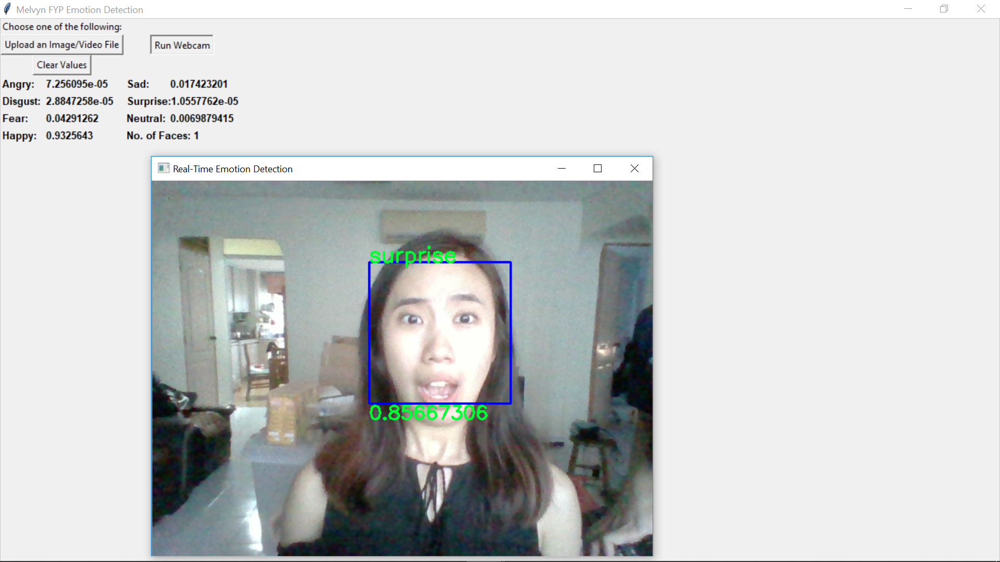
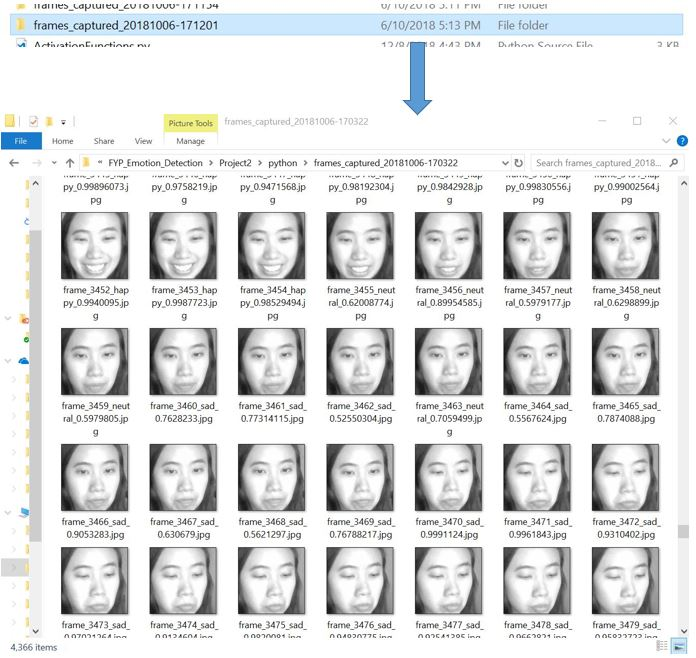

# Melvyn Final Year Project on Real-Time Emotion Detection System

**DEMO (Click to watch):**

  

**SUMMARY:**
To achieve a satisfactory result within the stipulated time-frame, the scope of this project is to classify six categories of emotions – **anger, fear, happy, sad, surprise** and **neutral**. The system classifies each image frame from the video into discrete emotion categories. The software application is written in Python programming language with OpenCV for processing images and videos. CNN-based approach is done with Google’s Tensorflow machine-learning library to construct the trained model. Lastly, Keras is used as the high-level neural networks API (application programming interface) that runs on top of Tensorflow. The model is trained and evaluated on the FER2013 dataset.

**TO START THE APP:**
1)	python emotion_detection_tk.py
2)  Choose 1 of the 2 options in the pop-up window to detect emotions
3)  To stop or exit the real-time detection, press 'q' on your keyboard

**Installed libraries:**
  - Tensorflow  (pip install tensorflow)
  - Keras (pip install keras)
  - Opencv
  - Tkinter
  - Pillow  (pip install Pillow)

**Dependencies:**
  - emotion_detection_model.json created to be run on-the-fly with the app
  - emotion_detection_weights.h5 defines the weights for the model between neurons
  - haarcascade_frontalface_default.xml is the face classifier for face detection

**Dataset:**
 - FER2013 dataset cannot be uploaded to GitHub due to the size limit
 - Download the FER2013 in Kaggle --> https://www.kaggle.com/c/challenges-in-representation-learning-facial-expression-recognition-challenge/data

**Path where main script (emotion_detection_tk.py) resides:**
  - C:\Users\User\Documents\GitHub\FYP_RealTime_EmotionDetection\python

**Path where frames captured are stored:**
  - e.g. C:\Users\User\Documents\GitHub\FYP_RealTime_EmotionDetection\python\frames_captured_20181013-152354
  - A new folder is created in every launch of the real-time detection
  

**External Resources**
  - Create user-friendly GUI with Tkinter --> https://likegeeks.com/python-gui-examples-tkinter-tutorial/
  - Build CNN Model --> https://www.pyimagesearch.com/2018/04/16/keras-and-convolutional-neural-networks-cnns/

> The overriding design goal for Markdown's
> formatting syntax is to make it as readable
> as possible. The idea is that a
> Markdown-formatted document should be
> publishable as-is, as plain text, without
> looking like it's been marked up with tags
> or formatting instructions.

This text you see here is *actually* written in Markdown! To get a feel for Markdown's syntax, type some text into the left window and watch the results in the right.

| Plugin | README |
| ------ | ------ |
| Dropbox | [plugins/dropbox/README.md][PlDb] |
| Github | [plugins/github/README.md][PlGh] |
| Google Drive | [plugins/googledrive/README.md][PlGd] |
| OneDrive | [plugins/onedrive/README.md][PlOd] |
| Medium | [plugins/medium/README.md][PlMe] |
| Google Analytics | [plugins/googleanalytics/README.md][PlGa] |

>>>>>>> 2dee8633b06bfdb324dbbcb1222663e2502b443a
